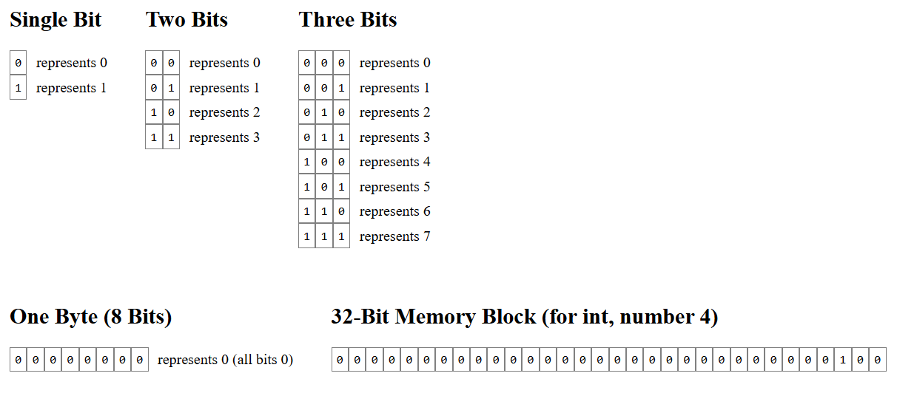
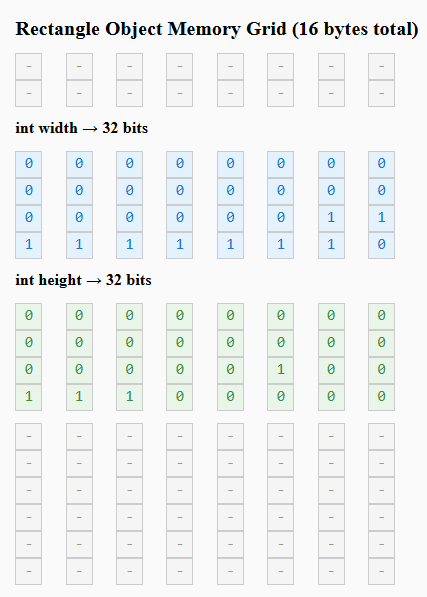

# Java

- **History**: High-level, object-oriented programming language developed by James Gosling and his team at Sun Microsystems in 1995. Originally named Oak, designed for portability across platforms. First public release in 1996. Sun Microsystems acquired by Oracle in 2010, which continues maintenance.

## 1. JDK vs JRE vs JVM

- **Development Workflow**: Java source files (.java) are compiled by the JDK's compiler into bytecode class files (.class). These can be packaged into JAR (Java Archive) files for distribution. The JRE, containing the JVM, executes the JAR files, allowing the program to run on any compatible platform.

| Component              | Description |
|------------------------|-------------|
| **JVM (Java Virtual Machine)** | Think of it as the "engine" that runs your Java programs. It takes the compiled Java code (bytecode) and executes it on your computer. Without JVM, Java programs can't run. It's like the player that makes the music from a CD. |
| **JRE (Java Runtime Environment)** | This is like a "package" that includes the JVM plus some extra libraries and files needed to run Java applications. If you just want to play (run) Java games or apps, you need JRE. It's everything you need to use Java programs, but not to create them. |
| **JDK (Java Development Kit)** | This is the full "toolbox" for creating Java programs. It includes the JRE (so you can run programs) plus tools like a compiler (to turn your code into bytecode), debugger (to fix bugs), and other helpers. If you're a programmer writing Java code, you need JDK. It's like having the studio equipment to record music, not just play it. |

## 2. Java vs C++: Technical Differences

- **Compilation and Execution**: Java source code is compiled to platform-independent bytecode, which runs on the JVM. C++ is compiled directly to native machine code for the target platform, requiring recompilation for different systems.

## 3. Understanding Bits and Memory Representation

A memory cell can hold single bit either 0 or 1.



## 4. Primitive Data Types

- **Description**: Java has several primitive data types for storing different kinds of values. These are the basic building blocks for data in Java programs.

| Data Type | Size (bits) | Size (bytes) | Range |
|-----------|-------------|--------------|-------|
| int      | 32         | 4           | -2,147,483,648 to 2,147,483,647 |
| float    | 32         | 4           | Approximately ±3.4028235E+38 |
| long     | 64         | 8           | -9,223,372,036,854,775,808 to 9,223,372,036,854,775,807 |
| double   | 64         | 8           | Approximately ±1.7976931348623157E+308 |

## 5. Understanding class memory

```java
class Rectangle { // 8 bytes
    int width; // 4 bytes
    int height; // 4 bytes
}
```



## 6. Class and Object

A class is a blueprint; an object is a concrete instance created from that blueprint.

- **Analogy**: Think of `Human` as the class (the blueprint), `Earth` as the JVM (the environment where objects run), and `john` or `david` as objects (instances) of the `Human` class living on the Earth (JVM).

- **Two components of a class**:
    - **Fields (properties)**: describe the state or characteristics. Example for `Human`: `eyes`, `legs` — these are fields that store data for each object.
    - **Methods (actions)**: define behavior or actions the class can perform. Example for `Human`: `walk()` — an action a Human can do.
    - **Constructor**: a special method used to initialize an object's fields when it is created. It's invoked when you call `new`, for example `new Human(2, 2)`. If you don't define any constructor, Java provides a default no-argument constructor. Inside a constructor you often use `this` to refer to the current object's fields (e.g., `this.eyes = eyes;`).

Example in Java:

```java
class Human {
    int eyes; // field: property (how many eyes)
    int legs; // field: property (how many legs)

    Human(int eyes, int legs) {
        this.eyes = eyes;
        this.legs = legs;
    }

    void walk() {
        if (legs == 1) {
            System.out.println("Can't walk");
        } else {
            System.out.println("Walking");
        }
    }
}

// Objects (instances) running on the Earth (the JVM)
Human john = new Human(2, 1);
Human david = new Human(2, 2);
john.walk();
david.walk();
```

Each object (for example, `john` and `david`) has its own field values but both follow the same `Human` blueprint. The JVM (Earth) executes the methods when those objects perform actions.